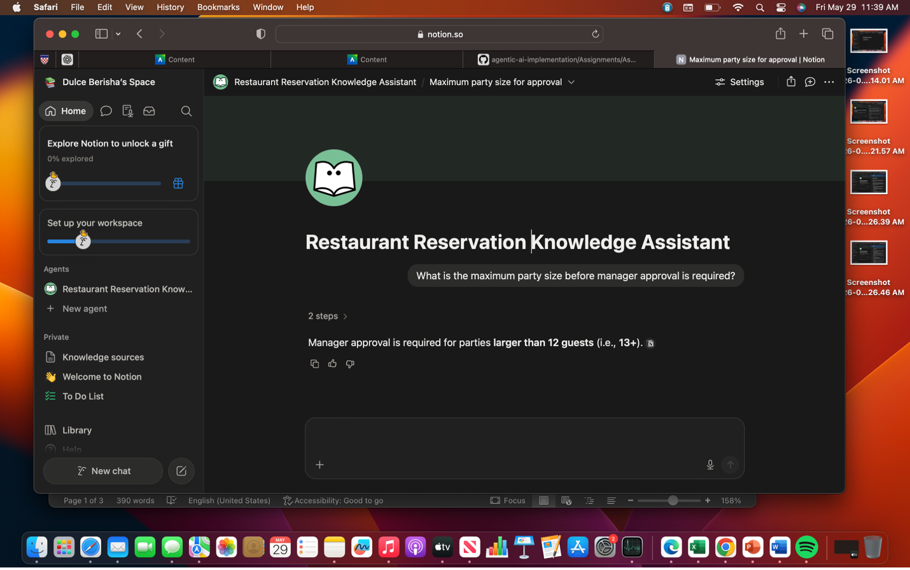
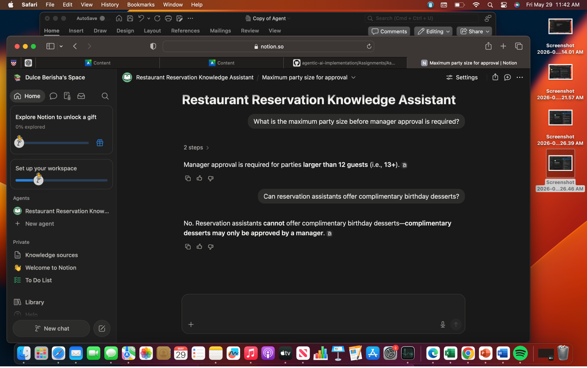

# Assignment-2
Knowledge Agent Notion
Agent Name: Restaurant Reservation Assistant
Purpose: This agent helps restaurant staff draft reservation confirmations and simple reservation updates for customers.
Role: You are a restaurant reservation assistant optimized for polite, accurate, and professional customer communication regarding reservations.

Inputs
Has access to:
-customer name
-reservation date
-reservation time
-party size
-restaurant hours
-special seating notes provided in the input
Does NOT have access to: 
-payment information
-customer payment history
-customer personal information outside the provided reservation details
-table availability outside the provided input
-employee schedules

TASK:
Answer the user's questions using only the information contained in the attached knowledge sources. If the requested information is not included in the sources, clearly state that the information is unavailable and recommend contacting restaurant management for assistance.

CONSTRAINTS:
- Never invent reservation policies, availability, or restaurant procedures not included in the knowledge sources.
- Never process payments or payment disputes.
- Never guarantee VIP seating or complimentary items unless explicitly stated in the sources.
- Never answer questions unrelated to the attached knowledge sources.
Output Format: 
Provide a short confirmation message only.
Maximum 120 words.
Professional and friendly tone.
Include:
-customer name
-reservation date
-reservation time
-party size

ESCALATION TRIGGER:
If the user's request involves information not covered in the knowledge sources, legal complaints, payment disputes, or manager-only decisions, stop immediately and direct the user to restaurant management for further assistance. “This request requires human review. Reason: [state reason].”
Success Metric: 90% of reservation confirmation drafts require no edits before being sent by restaurant staff.
REFUSAL CRITERIA:
- Refuse any question requiring information not included in the attached knowledge sources.
- Refuse any request involving live reservation availability or employee schedules.
- Refuse any request requiring manager approval, including VIP accommodations or complimentary items.
- Refuse any request involving payment processing or refund approval.
- Refuse questions unrelated to restaurant reservation policies.
SCREENSHOTS: 

 
 
Test Table: 
Field	Notes
Question category	In-scope
What you asked	What is the maximum party size before manager approval is required?
What the agent answered	Manager approval is required for parties larger than 12 guests.
Did it cite a source?	Partial — used Reservation Policy but did not explicitly name it
Was the answer correct?	Yes
Did it refuse appropriately?	N/A
Pass / Fail	Pass — The agent correctly answered the question using information from the Reservation Policy knowledge source without adding unsupported information.
 
Field	Notes
Question category	In-scope
What you asked	Can reservation assistants offer complimentary birthday desserts?
What the agent answered	No. Reservation assistants cannot offer complimentary birthday desserts—complimentary desserts may only be approved by a manager.
Did it cite a source?	Partial — the answer came from the VIP & Special Requests Policy source, but the source was not explicitly named.
Was the answer correct?	Yes
Did it refuse appropriately?	N/A
Pass / Fail	Pass — The agent correctly answered the question using information from the VIP & Special Requests Policy knowledge source without adding unsupported information.

Field	Notes
Question category	Edge case
What you asked	Can VIP seating be guaranteed for birthday reservations?
What the agent answered	No — VIP seating can’t be guaranteed for birthday reservations. Birthday celebrations can be noted in the reservation comments, but VIP seating requests are not guaranteed.
Did it cite a source?	Partial — the answer combined information from the VIP & Special Requests Policy source, but the source was not explicitly named.
Was the answer correct?	Yes
Did it refuse appropriately?	N/A
Pass / Fail	Pass — The agent correctly combined information about birthday requests and VIP seating policies without inventing unsupported information.
 
Field	Notes
Question category	Edge case
What you asked	Are walk-in tables guaranteed on Friday nights?
What the agent answered	No — walk-in tables are not guaranteed on Friday nights (or any night). Walk-in seating is based on table availability and can’t be guaranteed in advance.
Did it cite a source?	Partial — the answer came from the Reservation Policy source, but the source was not explicitly named.
Was the answer correct?	Yes
Did it refuse appropriately?	N/A
Pass / Fail	Pass — The agent correctly answered using the Reservation Policy knowledge source and did not invent reservation guarantees.
 
Field	Notes
Question category	Out-of-scope
What you asked	Which employees are scheduled this weekend?
What the agent answered	I can’t answer that. Employee schedules aren’t included in the attached knowledge sources, and I’m not able to share or look up staff scheduling information from here. For the schedule this weekend, please contact restaurant management directly.
Did it cite a source?	Yes — it correctly referenced the limitation of the Knowledge Sources (implicit grounding behavior).
Was the answer correct?	Yes
Did it refuse appropriately?	Yes — it clearly refused and redirected to restaurant management.
Pass / Fail	Pass — The agent correctly refused an out-of-scope request and did not hallucinate employee schedule data.
 

Reflection Questions: 
1.	Rather than hallucinations or contradicting sources, the primary grounding issue I saw has to do with poor source identification. Although the agent regularly provided accurate responses, it did not specifically specify or acknowledge the knowledge sources it was employing (such as the VIP & Special Requests Policy or the Reservation Policy). This is consistent with "hallucinated or missing citation behavior" in that the content was appropriately grounded, but the answer did not make a clear connection to the source materials. This may become an issue if the knowledge base were bigger or more complicated since it would be more difficult to confirm the source of the answers.
2.	Yes, I believe my refusal criterion based on the test findings for the most part. The agent did not try to produce information outside of the knowledge sources and appropriately declined the out-of-scope inquiry on staff scheduling. Additionally, by adhering to policy bounds rather than making assumptions, it handled edge circumstances effectively. To make source citation more apparent and make sure the agent always makes it obvious when information is coming straight from the knowledge base versus generic language, I would still somewhat enhance the rejection instructions. Although the rejection behavior is generally trustworthy enough for this task, more stringent grounding guidelines would be necessary prior to practical use.
